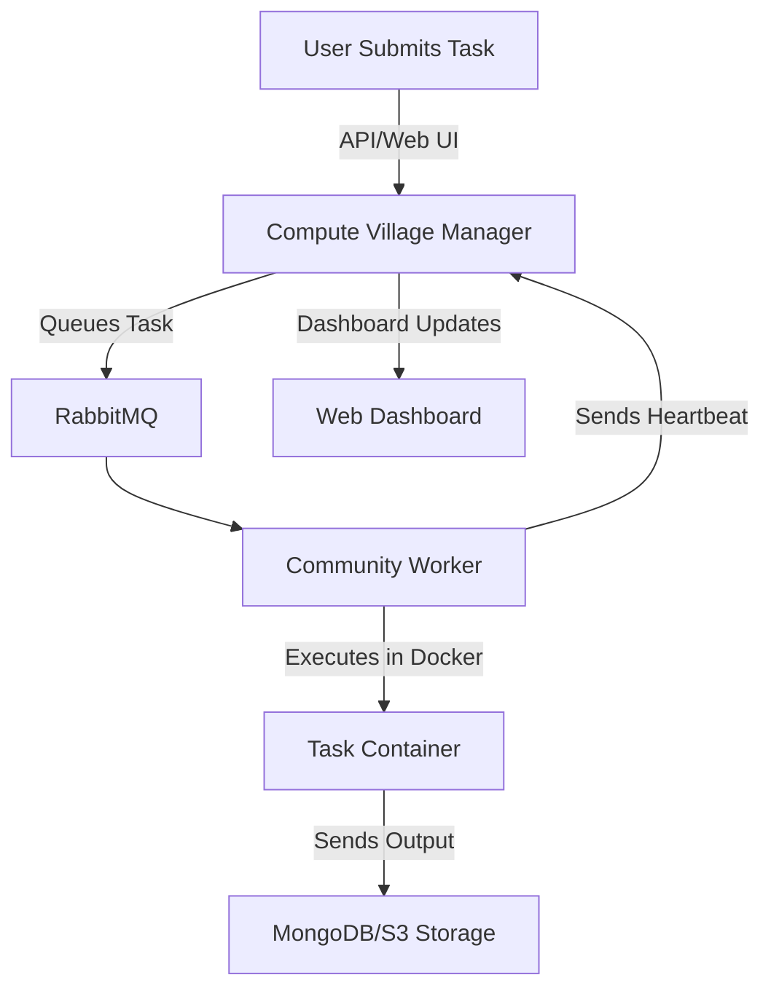

# 🏘️ Compute Village: The Decentralized Compute Hub 🚀

  
_A community-driven platform where anyone can share or request compute power!_

[](LICENSE)
[](https://www.docker.com/)
[](https://www.rabbitmq.com/)

---

## 🌍 Why Compute Village?

Tired of paying for expensive cloud compute? Want to contribute your spare computing power to meaningful tasks? **Compute Village** allows users to **share computing power** for **heavy-duty** tasks like:

✅ **Machine Learning Model Training**  
✅ **Web Scraping & Data Processing**  
✅ **CI/CD Pipelines & Automation**  
✅ **Video Rendering & Simulation**  
✅ **Scientific Computing & AI Research**  

### 🚀 Traditional Cloud vs Compute Village

| Feature 🏷️               | Traditional Cloud ☁️ | Compute Village 🏘️ |
|--------------------------|----------------------|------------------|
| **Pricing 💰**          | Expensive! Pay per use | Free or community-based! |
| **Setup Complexity 🛠️** | Requires cloud knowledge | Simple & decentralized |
| **Compute Source 🔥**   | Centralized servers  | Community-run machines |
| **Scalability 📈**      | Auto-scaling (costly) | Dynamic, community-powered |
| **Privacy & Security 🔐** | Managed (third-party control) | Localized, self-hosted |

💡 **Bottom Line:** Compute Village is the decentralized, cost-effective alternative to traditional cloud computing!

---

## ⚙️ How It Works



1️⃣ **Users submit tasks** via API/Web UI.  
2️⃣ **Tasks are queued** in **RabbitMQ** for smart distribution.  
3️⃣ **Community workers execute** tasks in **Docker containers**.  
4️⃣ **Results are stored** securely in **MongoDB or S3**.  
5️⃣ **Real-time dashboard** keeps you updated on everything!  

---

## 🌟 Key Features

| Feature 🚀              | Description 📜                                      | Benefit 💡                 |
|-------------------------|----------------------------------------------------|----------------------------|
| **Decentralized**      | Tasks run on community machines                     | Cost-efficient & flexible  |
| **RabbitMQ Queuing**   | Efficient task distribution & management           | No bottlenecks             |
| **Docker Isolation**   | Runs tasks in secured, isolated environments       | Prevents conflicts         |
| **Live Dashboard**     | Monitor workers, task status & system metrics      | Instant insights           |
| **MongoDB Integration**| Persistent task metadata storage                    | Reliable & scalable        |
| **Custom Task Setup**  | Define images, commands, env vars, and resources   | Adaptable to any workload  |

---

## 🏗️ Project Structure

```
compute_village/
├── manager/                     # Web Manager & API for task submission & monitoring
│   ├── main.py                   # FastAPI application entry point
│   └── managers/
│       ├── database.py           # MongoDB interactions
│       ├── rabbitmq.py           # RabbitMQ integration
│       └── tasks.py              # Task management logic
├── worker/                      # Worker node code for executing tasks
│   ├── main.py                   # Worker entry point
│   └── managers/
│       ├── database.py           # MongoDB updates for workers
│       ├── rabbitmq.py           # RabbitMQ client for receiving tasks
│       └── tasks.py              # Docker execution logic
├── examples/                     # Example task scripts (e.g., web scraping)
└── context.py                     # Utility for merging code files
```

---

## 🚀 Get Started

### 📋 Prerequisites
✅ **Python 3.8+**  
✅ **Docker**  
✅ **RabbitMQ** (with management plugin)  
✅ **MongoDB** instance  

### 🔧 Installation & Setup

1️⃣ **Clone the Repository:**
```bash
git clone https://github.com/agarwalvivek29/compute_village.git
cd compute_village
```

2️⃣ **Set Up Environment Variables:**
Create a `.env` file in the project root:
```env
MONGO_URI=mongodb://localhost:27017/
MONGO_DB=compute_village
RABBITMQ_HOST=localhost
RABBITMQ_QUEUE=default
```

3️⃣ **Start RabbitMQ:**
```bash
docker run -d --name rabbitmq -p 5672:5672 -p 15672:15672 rabbitmq:3-management
```

4️⃣ **Run Manager (Web API & Dashboard):**
```bash
cd manager
uvicorn main:app --reload
```
🎯 The API & dashboard will be available at **http://localhost:8000**.

5️⃣ **Run a Worker Node:**
```bash
cd worker
python main.py
```

6️⃣ **Submit a Task:**
Use **Postman**, `curl`, or the dashboard to submit a task!

---

## 📊 Dashboard

**Monitor everything in real-time!** 🖥️

✔️ **Task Status** (PENDING, RUNNING, COMPLETED)  
✔️ **Worker Health** (Active, Inactive, Heartbeats)  
✔️ **System Metrics** (Queue stats, execution times)  

🔗 Open **http://localhost:8000/dashboard** to view the live dashboard!

---

## 🛠️ Contributing

We ❤️ contributions! Join the movement:

- **Report Bugs** 🐛 → [Open an Issue](https://github.com/agarwalvivek29/compute_village/issues)
- **Suggest Features** 🚀 → [Submit a Pull Request](https://github.com/agarwalvivek29/compute_village/pulls)
- **Run a Worker Node** 💻 → Help execute community tasks!

---

## 📜 License

📝 Licensed under the **MIT License**. See [LICENSE](LICENSE) for details.

---

💡 **Compute Village: Power to the Community!** 🏘️💻🚀